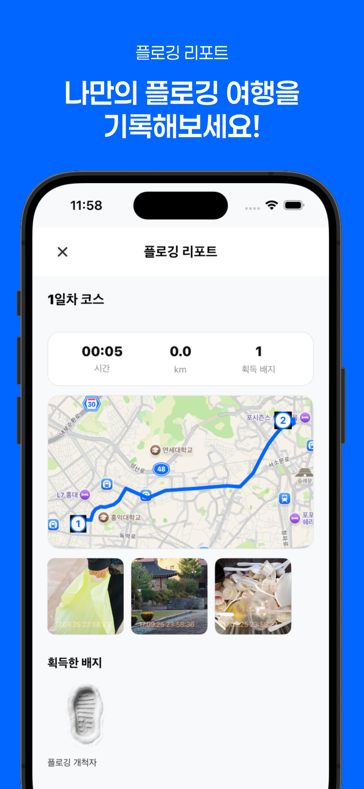

<h1 align="center">plomarble</h1>

---

## 📑 목차
1. [개요](#-개요)
2. [주요 기능](#-주요-기능)
3. [플랫폼 아키텍처](#-플랫폼-아키텍처)
4. [확장 방향](#-확장-방향)

---

## 📝 개요
세상을 더 깨끗하게 만드는 걷기 운동을 위해 **여행지를 추천하는 서비스** **"플로마블"**  

- 1인 개발자로서 **기획 → 개발 → 배포** 전 과정을 직접 수행  

  

  <!--  -->
  
  
  

## 💻 주요 기능

### 🔹 Server
- **모놀리식 API 서비스 + 추천 서비스**를 Ingress로 라우팅
- 한국관광공사 API 기반 **정형 데이터 획득 → 임베딩 벡터화 → Airflow DAG 자동화**
- **실시간 추천 코스 목록 제공**
  - **하이브리드 recall**  
    - OpenSearch lexical recall + Milvus semantic recall을 함께 사용해 초기 후보군을 구성  
    - 단순 벡터 유사도만 사용하던 초기 방식에서, **정확한 텍스트 일치와 의미 유사도**를 함께 반영하는 구조로 개선  
  - **SSE 기반 snapshot 응답**  
  - 양방향 상시 통신보다 **서버 → 클라이언트 단방향 스트리밍**이 목적에 더 잘 맞는다고 판단해 SSE를 적용  
  - 하나의 요청 안에서 snapshot 생성과 전송 흐름을 코루틴 단위로 분리해, **유연한 처리와 비교적 가벼운 실행 흐름**을 함께 가져가고자 함  
  - 앱에서는 이를 버퍼가 있는 것처럼 보이도록 구성해, 추천 결과가 정리되는 흐름을 자연스럽게 받아들일 수 있도록 설계  
    - 상위 결과는 고정하고, 하위 결과만 다른 조합으로 교체해 비교 가능한 코스 목록을 제공  
  - **가중치 기반 하위 목록 재구성**  
    - 상위 top-k를 anchor로 삼고, 하위 후보는 anchor 주변 관광지를 기준으로 재구성  
    - **후보 자체 점수 + anchor 점수 + 거리 + 주변 응집도**를 함께 반영  
    - 동일한 결과를 반복 노출하지 않도록 하위 후보군은 snapshot 간 중복을 줄이는 방향으로 구성
 
### 🔹 Client
- **Expo 기반 크로스플랫폼 앱 (iOS/Android)**
- **zustand**를 활용한 경량 상태 관리
- **Kakao Mobility 길찾기 API + OSRM API**를 활용한 보행자 길찾기 및 Polyline 시각화
- **Codex-CLI** 와 명세기반 협업을 통한 props-driling 문제 해결

### 🔹 Inference
- 추천 후보군 구성 과정에서 **lexical score / semantic score / 거리 기반 가중치**를 함께 조합해 결과를 보정

### 🔹 추천 구성 시 고민한 부분
- **정확도와 탐색성의 균형**
  - 단일 벡터 검색만 사용할 경우 의미적으로는 비슷하지만 사용자가 의도한 장소명이 상단에 오르지 않는 문제가 있었음
  - 이를 보완하기 위해 lexical recall을 함께 사용해 명시적 검색어에 더 강한 구조로 조정
- **한 번에 닫힌 응답보다, 흐름을 유지하는 응답**
  - 이 기능은 양방향 상호작용보다 서버에서 결과를 순차적으로 전달하는 것이 핵심이었기 때문에 WebSocket보다 SSE가 더 적합하다고 판단
  - 연결 단위의 흐름은 유지하되, 내부 처리는 코루틴 기반으로 분리해 snapshot 생성과 전송을 유연하게 가져가고자 함
  - 클라이언트에서는 이를 버퍼가 있는 것처럼 보이도록 구성해, 추천 결과가 한 번에 끊겨 보이지 않도록 조정
- **점수만 높은 목록이 아니라, 함께 제안할 수 있는 목록**
  - 상위 top-k는 고정하고, 하위 목록은 anchor 기반으로 주변 관광지를 확장하는 방식으로 구성해 단순 유사도 나열을 피하고자 했음
- **이전 방식과 현재 방식의 차이**
  - 이전
    - semantic score 중심의 단일 후보군 정렬
    - 정확한 장소명 질의가 들어와도 의미적으로 비슷한 장소가 앞설 수 있었음
  - 현재
    - lexical + semantic 하이브리드 recall로 초기 후보군 확보
    - SSE snapshot으로 추천 결과를 단계적으로 전달
    - 상위 top-k는 고정하고, 하위 목록은 anchor 기반으로 다시 조합
    - 거리와 응집도를 함께 사용해 “함께 제안할 수 있는 코스”에 더 가까운 형태로 보정

---

## 🏗 플랫폼 아키텍처

  

1. 단일 노드 환경에서 **namespace**를 활용해 서비스 분리 (milvus, plog, cert 등)  
2. 한국관광공사 정형 데이터를 가공 → **Milvus 벡터 DB(S3 기반)** 저장  
   - Airflow 파이프라인(local) + 포트 포워딩  
3. FastAPI 기반 text 임베딩 pod 구성

---

## 🌱 확장 방향
- 현재는 텍스트 유사도와 거리 응집도를 중심으로 후보군을 조합하고 있지만, 이후에는 **Neo4j를 통해 관광지 간 관계를 그래프로 매핑**해 보고 싶습니다.  
- 예를 들어 `비슷한 분위기`, `함께 방문되는 장소`, `도보 이동이 자연스러운 연결`, `카테고리 간 연관성` 같은 관계를 그래프 위에서 표현하면, 단순 거리 기반을 넘어 **더 풍성한 추천 가중치**를 설계할 수 있다고 생각합니다.  
- 이렇게 되면 현재의 lexical / semantic / 거리 기반 점수 위에 **관광지 간 관계 점수**를 추가하여, 더 맥락 있는 코스 추천으로 확장할 수 있습니다.  

---

## 📌 Summary
플로마블은 **여행 추천 + 걷기 운동 가치 확산**을 목표로,  
플로깅을 목적으로 여행을 계획하는 사람들을 위한 서비스입니다. 
